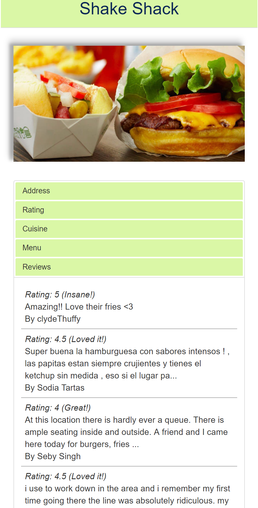

# ***Welp*** by the Tenacious Turtles
#### Made by Karina Ionkina, Leo Liu, Tiffany Moi, and Khyber Sen

## What's Welp?

Welp is a web app designed to provide users with information about nearby restaurants. 
Unlike Yelp, we are dedicated solely to recommendations on food.

Watch our demo! (*click on the picture*): 
[](https://youtu.be/8mA85GcYzu0)

## How Does It Work?


We use your GPS or IP address to find your location (with your permission of course) 
and pass it to the ***Zomato API*** to search for a list of restaurants around you. 
If you're uncomfortable with this or those results are inaccurate, 
or if you simply want to find restaurants near a different location, 
you can also manually enter in your zip code (this uses the ***Google Geocoding API***). 
You can also filter your search with key words using the search box, 
which is also passed along to Zomato to get a refined list of restaurants.


The closest 20 restaurants are automatically loaded on the page,
but if you want to see more, you can simply click the More Restaurants button
and they will load immediately, a result of aggressive caching and prefetching.
(Up to a max of 100 restaurants are shown, a limit set by Zomato).

Zomato also gives us information about the restaurants, including images of the restaurant. 
However, it doesn't have an image for most restaurants,
so for these restaurants, we scrape Google search for images related to the name of the restaurant. 

Zomato also gives us reviews and ratings, 
which we merge with ones that we receive from our users, 
which are stored in our own database.



By clicking on a restaurant,
a new page opens, giving more detailed information about the restuarant,
including its address, type of cuisine, a link to its menu, and its ratings and reviews,
which are combined with our own ratings.

Once logged in, a user is also able to favorite restaurants.
Once favorited, these restaurants will also appear in the user's profile page.
A user can also unfavorite a restaurant they have already favorited,
and can, in fact, favorite and unfavorite a restaurant extremely fast 
by repeatedly clicking the button.


After loggin in, a user is also able to add reviews to any restaurant.
Once a review is added, the user is unable to add another review,
which is done to prevent users spamming reviews and causing a skew in the ratings.
However, a user can also delete their review for a restaurant,
and then they can add a new one again.


## Launch Instructions

### 1. Clone this repository

#### ssh:

`git clone git@github.com:tmoi29/tenaciousTurtles.git`

#### https:

`git clone https://github.com/tmoi29/tenaciousTurtles.git`

### 2. Procure API keys

#### Zomato:

Go to the [Zomato API page](https://developers.zomato.com/api)

Request an API key

Get said key in e-mail

#### Google:

Go to the [Google Geocoding get API key page](https://developers.google.com/maps/documentation/geocoding/get-api-key)

Request an API key

Copy the API key from the confirmation screen

Save both keys in `secrets.json` in `/api`, according to the format of `secrets_template.json`

### 3. Prepare for launch

#### Virtualenv

We recommend you use a virtual environment to install dependencies for this site.

[To install virtualenv](https://virtualenv.pypa.io/en/stable/installation/)

[To create a virtualenv](https://virtualenv.pypa.io/en/stable/reference/#virtualenv-command)

To activate virtualenv in a Unix-based system:

`$ . <name of virtualenv>/bin/activate`

#### Install dependencies

With an activated virtualenv:

`pip install -r requirements.txt`

#### Sample database

If you want a sample database containing a few premade accounts and reviews:

   From the root of the repo:

   ```
   touch utils/generate_sample
   python utils/database.py
   rm utils/generate_sample
   ```

#### Reset database

If you want a blank database ready for usage:

   From the root of the repo:
   ```
   touch utils/generate_empty
   python utils/database.py
   rm utils/generate_empty
   ```


### 4. Launch

In the repository for this site:

`python app.py`

In a browser, navigate to:

`localhost:5000`

## The Hardworkers

|     Name      |    Role   |
|:-------------:|:-------------:| 
| Tiffany (PM)  | Flask, Database | 
| Khyber        | JS, AJAX, API calls   |
| Leo           | Database      | 
| Karina        | Frontend, Logo|
